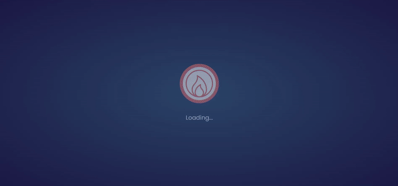
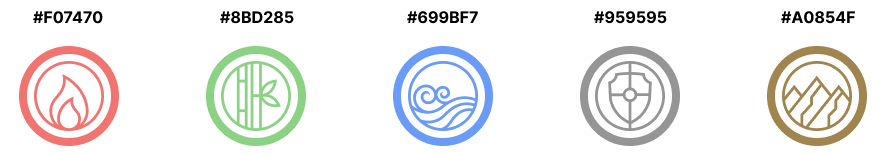
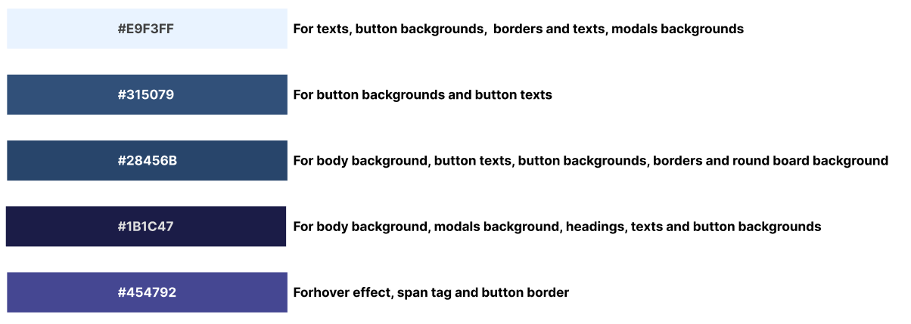
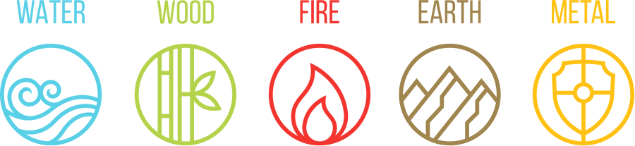
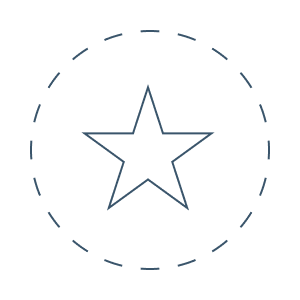
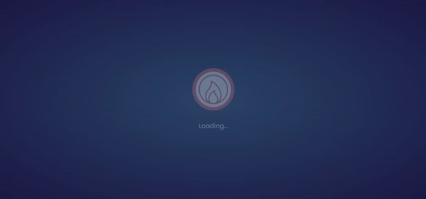

# **Five Elements Game**

The Five Elements Game is an extended variation of the classic Rock Paper Scissors game that many of us have played. The game has five elements (fire, earth, metal, water, wood) for the user to choose from. Each element defeats or is defeated by another element. In the classic game, we can predict the next move of the opponents according to their mimics, but in the Five Elements game, the opponent is the computer and computer's choices are completely random. Let's see if you can beat the computer...

You can view the live site here - \*\* [Five Elements Game](https://mika-sims.github.io/Five-Elements-Game/)

# Contents

- [**User Experience UX**](#user-experience-ux)
  - [User Stories](#user-stories)
  - [Wireframes](#wireframes)
  - [Design](#design)
    - [Typography](#typography)
    - [Colour Scheme](#colour-scheme)
    - [Imagery](#imagery)
    - [Social Media Icons](#social-media-icons)
    - [Favicon](#logo-and-favicon)
  - [Structure](#structure)
    - [Preloader](#preloader)
    - [Main Page](#main-page)
    - [Playground Section](#playground-section)
    - [Result Section](#result-section)
    - [Modals](#modals)
    - [Footer](#footer)

# User Experience UX

## User Stories

- As a user, I want to be able to understand the purpose of Five Elements Game from the main page.
- As a user, would like to see the title and images that give information about the content of the game.
- As a user, I would like to see how I can navigate the page with CTAs.
- As a user, I don't have to just click x-mark to close modals
- As a user, I would lik to see the rules of the game.
- As a user, I would like to see different round options available.
- As a user, I would like to see descriptive images of the choices I will make.
- As a user, I would like to be able to see the rules whenever I want while playing the game.
- As a user, I would like to see my and my opponent's scores on the scoreboard.
- As a user, I would like to see the round on the scoreboard.
- As a user, I would like to see a decisive effect when I hover over the option I want to select.
- As a user, I would like to see an effect that shows the round winner for each round played.
- As a user, I would like to see an effect that also clearly shows the draw.
- As a user, I would like to see a modal that shows the winner of the game when the game is over.
- As a user, I would like to see an option to play a new game after the game is over
- As a user, I want a default game to start even if I do not choose the total round I want to play.
- As a user, I would like to see social media icons

[Back to top](#contents)

## Wireframes

Wireframes were designed using [Balsamiq](https://balsamiq.com). Although wireframes show a very basic and simple design, a different result was obtained by modeling ideas and other sources that came to mind during the project development phase.

Wireframes design fils can be find at [Wireframes](assets/wireframes) folder.

[Back to top](#contents)

## Design

The page design has emerged as a result of a long-term research. The main design of the page was developed by modeling a challenge on the [Frontend Mentor](https://www.frontendmentor.io/challenges/rock-paper-scissors-game-pTgwgvgH) site.

[Back to top](#contents)

### Typography

Two fonts are preferred to have a simple design. Fonts are imported using the googlefonts API. "Poppins" is used in the body of the page and in all CTAs, "Roboto Condensed" in all titles, and the sans-serif font family is used as the fallback of both fonts.

[Back to top](#contents)

### Colour Scheme

Body background color is a radial-gradient color consisting of the combination of colors with HEX codes #28456b and #1b1c47.

The colors of the icons have been chosen by considering the colors corresponding to these elements in nature.

All other colors are used as indicated in the image below.

[Back to top](#contents)

### Imagery

- Game Icons

I downloaded the SVG image on [this](https://www.mosherhealth.com/mosher-health-system/chinese-medicine/yin-yang/five-elements) site that came across in the Five Element SVG search on Google and opened it with [Figma](https://www.figma.com/). After restyling the icons in Figma, I placed them on the web page. The original image is below.

- Main page background image

I found this image as a result of google searches. The original image was in .jpg format. I converted this image to svg format using [this](https://convertio.co/jpg-svg/) site and then re-styled it with Figma. The original image is below.

- Game board background image

I designed the image with a dotted border and a star inside the circle in the background of the game board in figma and imported it as SVG.

[Back to top](#contents)

### Social Media Icons

Social media icons are used in Figma by importing them into Figma using the [Iconify](https://www.figma.com/community/plugin/735098390272716381/Iconify) plugin and changing their colors.

[Back to top](#contents)

### Favicon

The background image of the main page is used as the favicon of the page. The favicon images and links that can be compatible with different devices are produced using the [Real Favicon Generator](https://realfavicongenerator.net/) web site.

[Back to top](#contents)

## Structure

Five Elements Game is a one-page website with a simple design. It provides the user with all the information about the page in simple and relatively less text. From color selection to typeface selection, everything is designed in a way that does not tire the eyes.

[Back to top](#contents)

### Preloader

Preloader is an animation in which the game icons are shown to the user at the page opening, rather than a preloader in the full sense. The "Loading..." text under the icons is also presented to the user to create the impression that the page is loading. However, taking longer than a normal preloader loading, may makes questioning whether this feature is necessary. But still, this is intended as part of the page's design rather than a page preloader.

[Back to top](#contents)
