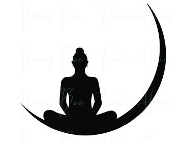
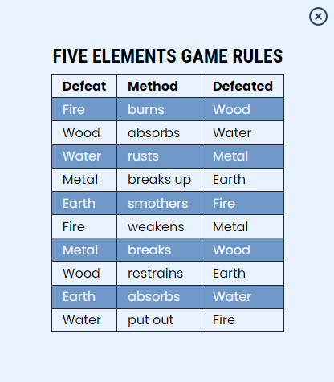

# **Five Elements Game**

The Five Elements Game is an extended variation of the classic Rock Paper Scissors game that many of us have played. The game has five elements (fire, earth, metal, water, wood) for the user to choose from. Each element defeats or is defeated by another element. In the classic game, we can predict the next move of the opponents according to their mimics, but in the Five Elements game, the opponent is the computer and computer's choices are completely random. Let's see if you can beat the computer...

You can view the live site here - \*\* [Five Elements Game](https://mika-sims.github.io/Five-Elements-Game/)

# Contents

- [**User Experience UX**](#user-experience-ux)
  - [User Stories](#user-stories)
  - [Wireframes](#wireframes)
  - [Design](#design)
    - [Typography](#typography)
    - [Colour Scheme](#colour-scheme)
    - [Imagery](#imagery)
    - [Social Media Icons](#social-media-icons)
    - [Favicon](#logo-and-favicon)
  - [Structure](#structure)
    - [Preloader](#preloader)
    - [Main Page](#main-page)
    - [Modals](#modals)
    - [Playground Section](#playground-section)
    - [Result Section](#result-section)
    - [Footer](#footer)

# User Experience UX

## User Stories

- As a user, I want to be able to understand the purpose of Five Elements Game from the main page.
- As a user, would like to see the title and images that give information about the content of the game.
- As a user, I would like to see how I can navigate the page with CTAs.
- As a user, I don't have to just click x-mark to close modals
- As a user, I would lik to see the rules of the game.
- As a user, I would like to see different round options available.
- As a user, I would like to see descriptive images of the choices I will make.
- As a user, I would like to be able to see the rules whenever I want while playing the game.
- As a user, I would like to see my and my opponent's scores on the scoreboard.
- As a user, I would like to see the round on the scoreboard.
- As a user, I would like to see a decisive effect when I hover over the option I want to select.
- As a user, I would like to see an effect that shows the round winner for each round played.
- As a user, I would like to see an effect that also clearly shows the draw.
- As a user, I would like to see a modal that shows the winner of the game when the game is over.
- As a user, I would like to see an option to play a new game after the game is over
- As a user, I want a default game to start even if I do not choose the total round I want to play.
- As a user, I would like to see social media icons

[Back to top](#contents)

## Wireframes

Wireframes were designed using [Balsamiq](https://balsamiq.com). Although wireframes show a very basic and simple design, a different result was obtained by modeling ideas and other sources that came to mind during the project development phase.

Wireframes design fils can be find at [Wireframes](assets/wireframes) folder.

[Back to top](#contents)

## Design

The page design has emerged as a result of a long-term research. The main design of the page was developed by modeling a challenge on the [Frontend Mentor](https://www.frontendmentor.io/challenges/rock-paper-scissors-game-pTgwgvgH) site.

[Back to top](#contents)

### Typography

Two fonts are preferred to have a simple design. Fonts are imported using the googlefonts API. "Poppins" is used in the body of the page and in all CTAs, "Roboto Condensed" in all titles, and the sans-serif font family is used as the fallback of both fonts.

[Back to top](#contents)

### Colour Scheme

Body background color is a radial-gradient color consisting of the combination of colors with HEX codes #28456b and #1b1c47.

The colors of the icons have been chosen by considering the colors corresponding to these elements in nature.

All other colors are used as indicated in the image below.

[Back to top](#contents)

### Imagery

- Game Icons

I downloaded the SVG image on [this](https://www.mosherhealth.com/mosher-health-system/chinese-medicine/yin-yang/five-elements) site that came across in the Five Element SVG search on Google and opened it with [Figma](https://www.figma.com/). After restyling the icons in Figma, I placed them on the web page. The original image is below.

See Game Icons original image

- Main page background image

I found this image as a result of google searches. The original image was in .jpg format. I converted this image to svg format using [this](https://convertio.co/jpg-svg/) site and then re-styled it with Figma. The original image is below.

See Main page background image

- Game board background image

I designed the image with a dotted border and a star inside the circle in the background of the game board in figma and imported it as SVG.

[Back to top](#contents)

### Social Media Icons

Social media icons are used in Figma by importing them into Figma using the [Iconify](https://www.figma.com/community/plugin/735098390272716381/Iconify) plugin and changing their colors.

[Back to top](#contents)

### Favicon

The background image of the main page is used as the favicon of the page. The favicon images and links that can be compatible with different devices are produced using the [Real Favicon Generator](https://realfavicongenerator.net/) web site.

[Back to top](#contents)

## Structure

Five Elements Game is a one-page website with a simple design. It provides the user with all the information about the page in simple and relatively less text. From color selection to typeface selection, everything is designed in a way that does not tire the eyes.

[Back to top](#contents)

### Preloader

Preloader is an animation in which the game icons are shown to the user at the page opening, rather than a preloader in the full sense. The "Loading..." text under the icons is also presented to the user to create the impression that the page is loading. However, taking longer than a normal preloader loading, may makes questioning whether this feature is necessary. But still, this is intended as part of the page's design rather than a page preloader.

[Back to top](#contents)

### Main Page

After the preloader is fade-out, a very simple main page appears. It gives information about the page in simple and short writing and guides the user to the next section with animated CTA.

See  Main Page Image

[Back to top](#contents)

### Modals

There are various modals to guide and inform the user about the game.

- Greeting Modal

After clicking the LET'S START button on the main page, the greeting modal opens. The greeting modal presents the user two options. To see the rules of the game or skip to the next section to play the game right away. When the RULES button is clicked in the greeting modal, a modal with the table showing the rules opens. The greeting modal also lags behind this modal, because the button that will take the user to the next section after the rules modal is closed is in this modal.

See Greeting Modal

 

- Rules Modal

The rules modal presents the rules of the game in a table. The table has three columns and 11 rows. İlk satırda mağlubiyet, mağlubiyet ve bu iki başlık arasında mağlubiyetin hangi yöntemi kullandığını gösteren yer almaktadır. When the x-mark in the modal or outside the modal is clicked, the rules modal is closed. After the rules modal is closed, the greeting modal reappears. As in the rules modal, clicking the x-mark or outside of the modal in greeting modal closes the modal and moves to the next section.

See Rules Modal

 

- Round Selection Modal

In this modal, the user is given three options for how many rounds they want to complete the game. The background of the item showing the selected number of rounds changes to a reddish color. If the PLAY button is clicked after the option is selected or without the option being selected, the playground section will be opened. If the user presses the PLAY button without choosing how many rounds to play, the game will be 3 Rounds by default. In order to close this model, it is necessary to click the PLAY button.

See Round Selection Modal

 

- Game Winner Modal

The Game Winner modal appears automatically after the number of rounds to be played is over and shows the winner of the game with an animated text. Also, this modal prompts the user to play a new game or return to the homepage. In this modal, the user can select the number of rounds again or start a new game by clicking the x-mark in the modal or outside the modal.

See Game Winner Modal

 

[Back to top](#contents)

### Playground Section

The playground section, where the names of the icons in the game are used as the title, and under this title, the smaller versions of the icons are placed. The design of this section was inspired by the challenge on the Frontend Mentor site. Just below the icons, there is a RULES button so that the user can check it whenever needed. As with all sections, there are social media icons that lead to social media accounts at the bottom of this section.

See Game Winner Modal

 

[Back to top](#contents)

### Result Section

The result section appears after the user has made the selection, with an animated transition and fade-out of the playground section and fade-in of the result section. The icon of the winning side is highlighted with a flash effect. If the result is a draw, the text DRAW is displayed in the same way. The winning side's score and round increase. Below the icons is the CTA that directs the user to play the next round. When the NEXT ROUND CTA is clicked, with fade-out and fade-in animation effect, the result section and the playground section are replaced.

See Game Winner Modal

 

[Back to top](#contents)

### Footer

In the footer section there are only two icons showing social media accounts. The colors are not very distinctive in order not to distract.

See Game Winner Modal

 
